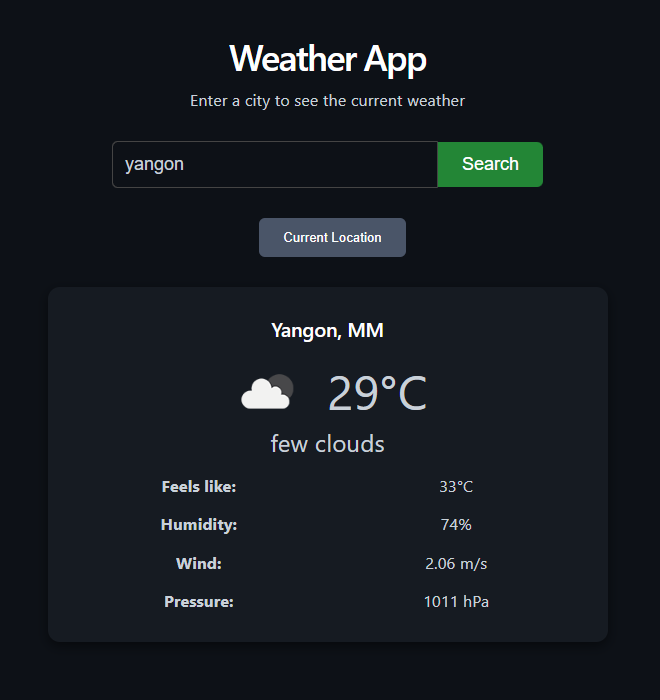

### 3. For Weather App (`weather-app`)

```markdown
# React Weather App

A simple weather application built with React + Vite that fetches real-time weather data using a public API.

## Live Demo
https://agmyathtun.github.io/weather-app/

## Features
- Search weather by city name
- Displays current temperature, condition, humidity, wind speed
- Loading spinner during API fetch
- Error handling (invalid city, network issues)
- Responsive design (mobile-friendly)

## Tech Stack
- React 18
- Vite
- useState + useEffect hooks
- Fetch API for real weather data
- Conditional rendering (loading/error/success)
- GitHub Pages deployment

## Screenshots

### Weather Data Display (Success)



## How to Run Locally

```bash
git clone https://github.com/Agmyathtun/weather-app.git
cd weather-app
npm install
npm run dev